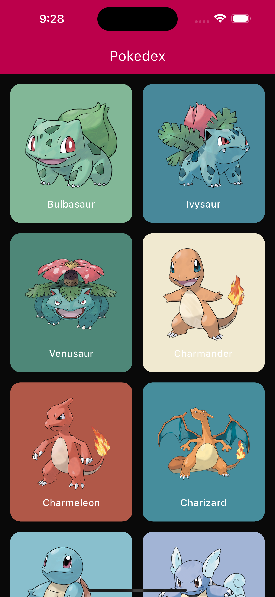
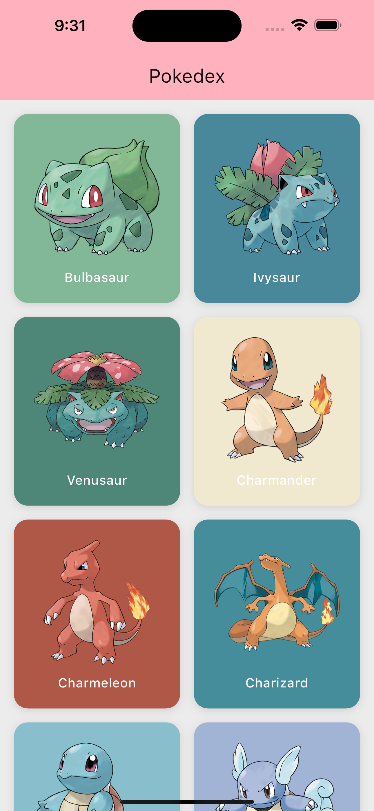
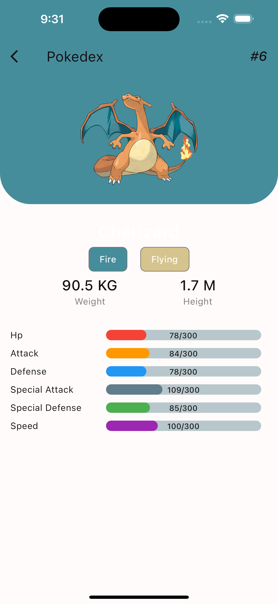

# Pokédex

Pokédex application developed with Flutter.

This application is inspired by [skydoves/Pokedex](https://github.com/skydoves/Pokedex) application for Android.

## Getting Started

This project is a starting point for a Flutter application.

Here are a few resources to get you started if this is your first Flutter project:

- [Lab: Write your first Flutter app](https://docs.flutter.dev/get-started/codelab)
- [Cookbook: Useful Flutter samples](https://docs.flutter.dev/cookbook)

For help getting started with Flutter development, view the
[online documentation](https://docs.flutter.dev/), which offers tutorials,
samples, guidance on mobile development, and a full API reference.

## 📱 Features

- [x] View for Pokémon List
- [x] View for Pokémon Details
- [x] Light/Dark Theme

## 📸 Screenshots

### GIF


### Dark Theme

| Overview                                              | Detail                                                |
|-------------------------------------------------------|-------------------------------------------------------|
|  |  |

### Light Theme

| Overview                                               | Detail                                                 |
|--------------------------------------------------------|--------------------------------------------------------|
|  |  |

## Architecture


[architecture diagram](./arch-dagre.svg)

### Folder Structure

The folder structure of this project is as follows:

```txt
pokedex/
├── android/
├── assets/
├── ios/
├── lib/
│   ├── app.dart     <-- all the application level configurations are defined here
│   ├── main.dart    <-- starting point of the application
│   ├── app/         <-- all the application level configurations are defined, e.g., routes, title, orientation etc.
│   │   ├── config/
│   │   ├── dependency_injection/
│   │   ├── helpers/
│   │   ├── service_result/
│   │   └── services/
│   │       └── api/
│   ├── features/          <-- all features are represented as a subfolder
│   │   ├── home/          <-- feature 'home' screen
│   │   │   ├── data/            <-- a feature's data layer, includes data source (either local or remote)
│   │   │   ├── domain/          <-- a feature's domain layer, includes repository and params 
│   │   │   └── presentation/    <-- a feature's presentation layer, includes widgets and screen
│   │   └── splash/              <-- feature 'splash' screen
│   │       └── presentation/
│   └── src/                     <-- all application level constants, extensions and themes
│       ├── constants/           <-- all the application level constants here, e.g., baseURLs
│       ├── extensions/
│       └── res/                 <-- all themes and colors
│           ├── color_scheme/
│           └── theme/
└── test/
```

## Build and Run

Go to the project root and execute the following command to get the required dependencies:

```sh
flutter pub get
```

To run the project as an Android app, start the Android emulator and then run the following:

```sh
flutter run
```

To build an Android APK run the following:

```sh
flutter build apk
```

## Packages & Tools Used

- [Cached Network Image](https://github.com/Baseflow/flutter_cached_network_image) (Image Caching)
- [Dio](https://github.com/cfug/dio/tree/main/dio) (HTTP calls)
- [Palette Generator](https://github.com/flutter/packages/tree/main/packages/palette_generator) (Generate color palette from image)
- [Percent Indicator](https://github.com/diegoveloper/flutter_percent_indicator/) (Percent Indicator)

External data source:

- [PokeAPI](https://pokeapi.co) (RESTful Pokémon API)

## License

Copyright © 2023 Enoch Aikpokpodion

This work (source code) is licensed under  [MIT](./LICENSE).
